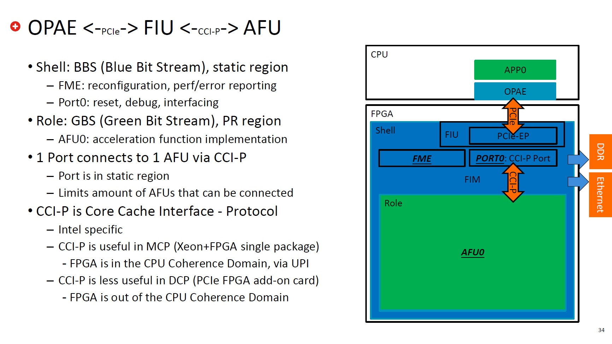
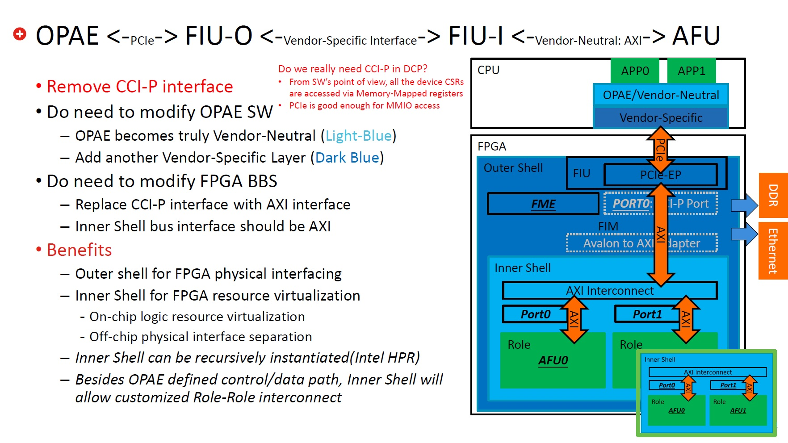
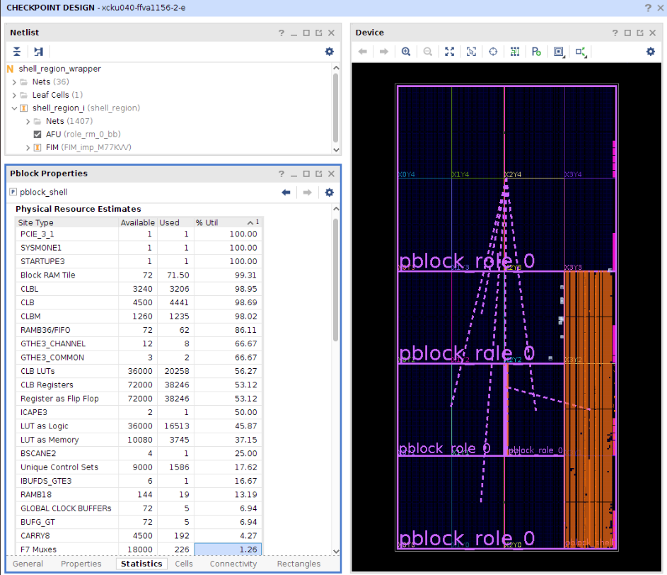
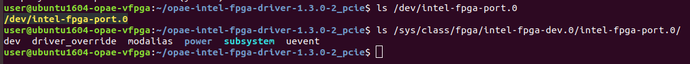
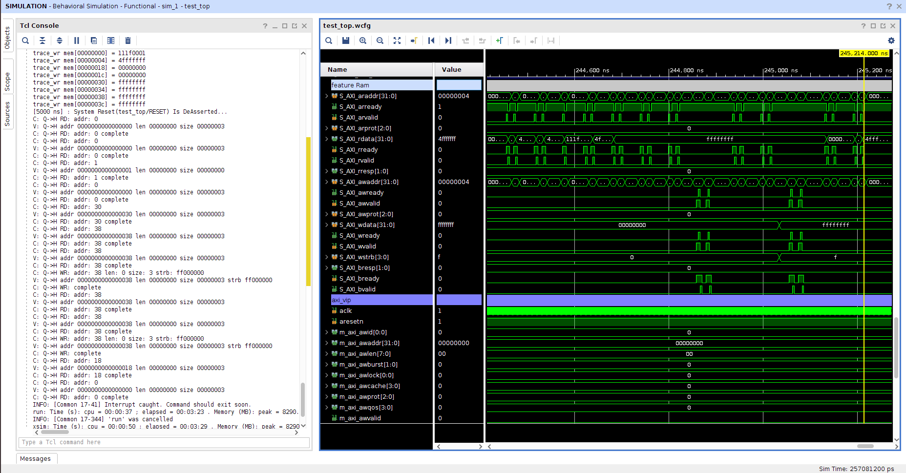
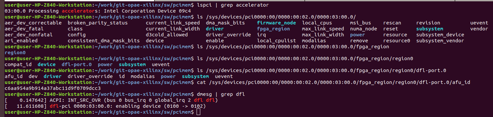

<span style="display: inline-block;">

# Table of Contents
1. [Overview of opae-xilinx](#overviewopaex)
    - [Original OPAE](#overviewopaeorig)
    - [Ported OPAE](#overviewopaeport)
        - [FIM and AFU design](#overviewopaeportfimandafu)
        - [Using AXI instead of CCI-P](#overviewopaeportaxivsccip)
        - [Minimum FIM design](#overviewopaeportminfim)
    - [Demo: Full-System Simulation with QEMU (On virtual machine)](#overviewqemusim)
    - [Demo: Compatability with Linux dfl-pci driver (On physical machine)](#overviewlinuxdfl)
    - [Sample Applications: Xilinx CDMA](#samplexilinxcdma)
    - [Directory Structure](#overviewdirstr)
    - [Development Tools](#overviewdevtools)
2. [Getting Started](#gettingstarted)

<a name="overviewopaex"></a>
# Overview of opae-xilinx
The purpose of this project is to port [OPAE](https://01.org/opae) to Xilinx FPGA devices. 

<a name="overviewopaeorig"></a>
## The original OPAE and FPGA accelerator:


<a name="overviewopaeport"></a>
## The ported OPAE and FPGA accelerator:


<a name="overviewopaeportfimandafu"></a>
### FIM and AFU design
To be discoverable and managable by the OPAE PCIe driver, the design of FIU(FPGA Interface Unit, the PCIe interface logic) should be compliant with the OPAE specification. So a major design effort is put into the FIM(FPGA Interface Manager) part, which is a static 'Shell' that resides persistantly in the FPGA. 

Based on the 'Shell', a design flow([Partial Reconfiguration](https://www.xilinx.com/support/documentation-navigation/design-hubs/dh0017-vivado-partial-reconfiguration-hub.html)) of the AFU(Accelerator Function Unit) part, which is a dynamic 'Role' that can be swapped in and out of the FPGA, is setup to utilize open-source projects supporting HLS, such as [FINN](https://github.com/Xilinx/FINN), [VTA](https://github.com/apache/incubator-tvm/tree/master/vta), [BISMO](https://github.com/EECS-NTNU/bismo), [GEMM_HLS](https://github.com/spcl/gemm_hls), [hls4ml](https://fastmachinelearning.org/hls4ml/), [HeteroCL](https://github.com/cornell-zhang/heterocl), [hlslib](https://github.com/definelicht/hlslib), [pp4fpgas](https://github.com/KastnerRG/pp4fpgas/tree/master/examples) and [Vitis Library](https://github.com/Xilinx/Vitis_Libraries) L1 modules.

<a name="overviewopaeportaxivsccip"></a>
### Using AXI instead of CCI-P
Although the OPAE specification mandates the use of [CCI-P](https://01.org/sites/default/files/downloads/opae/cci-p-mpf-overview.pdf) interface between FIM and AFU when targeting Intel MCP and DCP platforms, this project uses AXI interface instead. The inclusion of an industry standard interface makes the OPAE ecosystem truly [Vendor Neutral](https://github.com/RSPwFPGAs/opae-xilinx/wiki/The-evolution-to-Vendor-Neutral-OPAE) and makes the many IPs targeting ASIC designs available to FPGA designers, such as [MatchLib](https://github.com/NVlabs/matchlib) and [HLSLibs](https://github.com/hlslibs).

<a name="overviewopaeportminfim"></a>
### Minimum FIM design
The FIM design is kept to a minimum. On KCU105 platform, over 91% logic area is reserved for the AFU. That is 458k LCs for the accelerator logic.



<a name="overviewqemusim"></a>
## Demo: Full-System Simulation with QEMU (Tested with XSIM on virtual machine)
A full-system simulation, which involves application/driver software code and FIM/AFU hardware logic, not only speeds up the development and debugging process of the SW/HW interface, but also enables the evaluation of this full-stack solution without a physical FPGA acceleration card. Please take a look at the [README](./sw/QEMU/qemu_hdl_cosim/) for details.

### OPAE-scan results in QEMU-HDL co-simulation:


### OPAE-scan AXI-bus transaction waveform in QEMU-HDL co-simulation:


<a name="overviewlinuxdfl"></a>
## Demo: Compatibility with Linux dfl-pci driver (Tested with U50 on physical machine)
"[FPGA Device Feature List(DFL)](https://www.kernel.org/doc/html/latest/fpga/dfl.html)" framework is [involved in Linux 4.19 kernel in 2018](https://www.phoronix.com/scan.php?page=news_item&px=FPGA-DFL-Linux-4.19). On Ubuntu 18.04.4 LTS with kernel version 5.3, the FIM can be successfully identified and the AFU can be enumerated.

### DFL enumeration result


<a name="samplexilinxcdma"></a>
## OPAE Sample Applications: Hello_FPGA with Xilinx CDMA
[Application of Xilinx CDMA IP in C.](./sw/OPAE/sdk/opae-sdk-1.3.0-2/samples)

[Application of Xilinx CDMA IP in Python.](./sw/OPAE/sdk/opae-sdk-1.3.0-2/pyopae/samples)

The above sample applications have been validated in the QEMU-HDL co-simulation environment.

### Docker script to setup an OPAE run-time environment
[Build OPAE 1.3.0 on Ubuntu 16.04 from source code](./sw/Docker/ubuntu1604).

[Build OPAE 1.4.0 on Ubuntu 18.04 from source code](./sw/Docker/ubuntu1804).

[The original script is here](https://github.com/akirajoeshoji/docker-intel-pac-rte). Thank you so much akirajoeshoji, for the inspiration!

<a name="overviewdirstr"></a>
## Directory Structure
```
.
├── doc
│   ├── dmesg
│   └── pics
├── hw
│   ├── prj
│   │   ├── afu
│   │   ├── blue_bs
│   │   ├── fim
│   │   ├── green_bs
│   │   └── qemu_hdl_cosim
│   └── src
│       ├── afu_customize
│       ├── constraints
│       ├── hdl
│       ├── ip
│       ├── ipi
│       ├── qemu_hdl_cosim
│       └── sim
└── sw
    ├── Docker
    ├── OPAE
    │   ├── driver
    │   └── sdk
    │       └── opae-sdk-1.3.0-2
    │           ├── pyopae
    │           │   └── samples
    │           └── samples
    └── QEMU
        └── qemu_hdl_cosim
```

<a name="overviewdevtools"></a>
## Development Tools
The FPGA projects are designed with 2018.3 release of Vivado and Vivado HLS.

The FPGA platforms currently supported are [Xilinx Kintex UltraScale FPGA KCU105 Evaluation Kit](https://www.xilinx.com/products/boards-and-kits/kcu105.html) and [Alveo U50 Data Center Accelerator Card](https://www.xilinx.com/products/boards-and-kits/alveo/u50.html) from Xilinx.

<a name="gettingstarted"></a>
# Getting Started
To get started with the design of FIM and AFU, or the generation of Blue and Green bitstreams, follow the README in ecah of the directories under [./hw/prj](./hw/prj/).

# ToDo List
01. [Done] Add Container scripts to install OPAE driver/sdk/pyopae - Clean environment.
02. Use Verilator/GtkWave in the QEMU-HDL cosimulation - Truely open source tools based; Mixed C/Verilog simulation.
03. [Done] Port Xilinx PR driver to OPAE - FME functionality enhancement.
04. [Done] Add Ethernet interface to the FIM - FIM functionality enhancement/AFU BBB optional component logic.
05. Add DDR interface to the FIM - FIM functionality enhancement/AFU BBB optional component logic.
06. [Done] Add AFU BBB logic components and compilation flow scripts - A synthesis flow for automatic HLS IP integration.
07. [Done] Optimize FIM pyhsical constraints - Available area estimation for AFU.
08. Test compliance with [IFPGA Rawdev Driver](https://doc.dpdk.org/guides/rawdevs/ifpga.html)

# Wish List
01. Support SR-IOV.
02. Support dual PF.
03. Add AFU BBB logic components for supporting OpenCL/SyCL/oneAPI - ?.
04. PYNQ/XRT compliant - ?.
05. VirtIO NIC compatible with [ixy](https://github.com/emmericp/ixy) user space driver - Network attached accelerator (SmartNIC).
06. Add a [RISC-V Core](https://github.com/SpinalHDL/VexRiscv) as an AXI-Lite master in the FIM - Autonomous task scheduling and hardware microservice.
